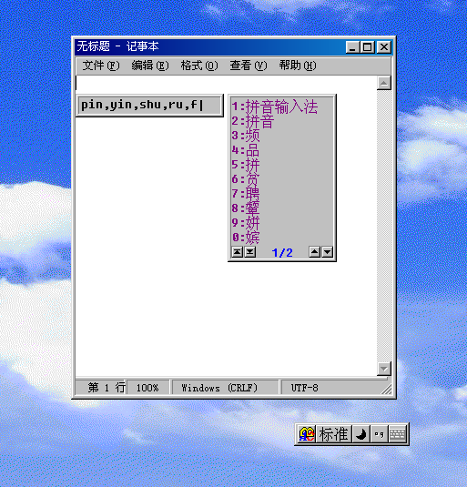

# ClassicABC (经典ABC) — A Windows Pinyin Input Method

> **[中文版本](README_ZH.md)**

ClassicABC is a **Windows Chinese pinyin input method** with dual backend support for both the modern TSF (Text Services Framework) and the legacy IMM32 system. It provides a full-featured pinyin input experience with candidate window, Chinese punctuation, and customizable 9-patch skin support.

**This project was developed with the assistance of AI.**

---

## Features

- **Dual backend**: TSF COM text service + legacy IMM32 IME
- **Pinyin input**: Full syllable splitting, character frequency weighting, user dictionary with learning
- **Chinese punctuation**: Automatic full-width character conversion in Chinese mode
- **Navigation**: Page buttons (first/last/prev/next) with page number display
- **Settings bar**: Draggable status bar with mode/lock/punctuation indicators
- **9-patch skinning**: All windows use stretchable PNG skins
- **x64 + Win32**: Ships both 64-bit and 32-bit builds

## Screenshot



---

## Building

### Prerequisites

- Visual Studio 2022 (MSVC v143)
- C++17 support
- MSBuild in PATH or installed at `D:\VisualStudio`

### Build

```batch
.\build.bat
```

This builds both x64 and Win32 in Release configuration. Output:

| Architecture | TSF DLL | IMM32 IME |
|---|---|---|
| x64 | `output\abcimex64.dll` | `output\abcimex64.ime` |
| Win32 | `output\abcime.dll` | `output\abcime.ime` |

---

## Project Structure

```
├── build.bat                  # Build script (x64 + Win32)
├── abcime.sln                 # VS2022 solution (TSF + IME)
├── abcime.props               # Shared MSBuild properties
├── data/                      # Dictionary files
│   ├── pinyin_map.txt         # Pinyin → character map
│   ├── char_freq.txt          # Character frequency table
│   ├── user_dict.txt          # User word dictionary
│   └── emoji.txt              # Emoji pinyin map
├── res/                       # PNG/ICO skin resources
├── output/                    # Build output + install scripts
└── src/
    ├── candidate_item.cpp/.h   # Candidate data structure
    ├── pinyin_composition.cpp  # Candidate aggregation
    ├── pinyin_data.cpp/.h      # Dictionary caches
    ├── pinyin_file_io.cpp/.h   # Dictionary I/O
    ├── pinyin_matcher.cpp/.h   # Character/word matching
    ├── pinyin_split.cpp/.h     # Syllable segmentation
    ├── pinyin_virtual_cursor   # Virtual cursor operations
    ├── word_matcher.cpp/.h     # Word candidate collection
    ├── util.cpp/.h             # Logging, UTF-8 helpers
    └── win/                    # Windows adapter layer
        ├── proto_core.cpp/.h   # ProtoIME coordinator (facade)
        ├── proto_engine.cpp/.h # Engine state machine
        ├── proto_ui.cpp/.h     # GDI+ UI (candidate + settings)
        ├── TSF/                # TSF COM frontend
        └── IME/                # IMM32 frontend
```

---

## Architecture

```
Application (Notepad, Console, etc.)
    │
    ├── TSF COM  ───→ abcime.dll
    └── IMM32    ───→ abcime.ime
            │
            ▼
    ┌───────────────┐
    │  ClassicABC    │  ← Unified facade
    ├───────┬───────┤
    ▼       ▼       ▼
  UI    Engine  Keys
  GDI+  State   Process
        │
        ▼
  ┌──────────────┐
  │ Pinyin Lib   │
  │ split/match  │
  │ composition  │
  │ dictionary   │
  └──────────────┘
```

---

## Usage

### Keyboard Shortcuts

| Key | Action |
|---|---|
| **Shift** (tap) | Toggle Chinese/English mode |
| **CapsLock** | Force English mode |
| **1-9, 0** | Select candidate (1-9, 0=10th) |
| **Space** | Select first candidate |
| **-** / **=** | Previous / Next page |
| **Delete** | Toggle delete mode |
| **←** / **→** | Move virtual cursor in pinyin buffer |
| **Backspace** | Delete pinyin character |
| **Esc** | Clear buffer |
| **Enter** | Commit raw buffer text |

### Chinese Punctuation

In Chinese mode (no active composition), punctuation keys convert to full-width:

| Unshifted | Shifted |
|---|---|
| `` ` `` → `·` | `~` → `～` |
| `,` → `，` | `<` → `《` |
| `.` → `。` | `>` → `》` |
| `\` → `、` | `|` → `｜` |
| `;` → `；` | `:` → `：` |
| `'` → `''` | `"` → `""` |
| `[` → `【` | `{` → `｛` |
| `]` → `】` | `}` → `｝` |
| `-` → `－` | `_` → `——` |
| `=` → `＝` | `+` → `＋` |
| `/` → `／` | `?` → `？` |

**Numpad** `*`, `/`, `+`, `-` are never converted.

---

## Runtime Configuration

| File/Flag | Description |
|---|---|
| `data/` | Place alongside DLL or at `%ProgramData%\ClassicABC\data\` |
| `res/` | Place alongside DLL or at `%ProgramData%\ClassicABC\res\` |
| `proto_debug_enable.flag` | Empty file; enables debug logging when present |

---

## License

This project is provided as-is.

---

## Acknowledgments

- Based on the Weasel/Rime TSF sample project structure
- **This project was developed with the assistance of AI (Opencode)**